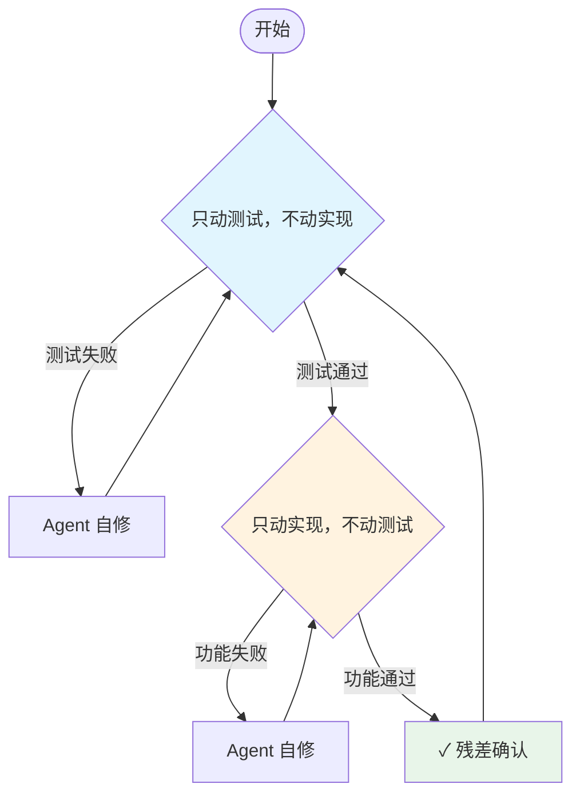
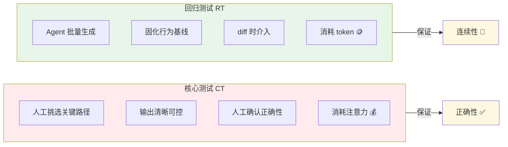

# Agent 时代的测试：只关注行为的"残差"

> 测试和实现，永远只改一边。

## "糙快猛"的问题

目前很多人用 Agent 的手法就是照搬一个"交作业式"的 Agent workflow：

- 整理好需求/spec，例如"开发一个数据获取框架，要求实现功能 1 2 3 4 5"
- 把 spec 发给 Agent 做实现
- 审核 Agent 实现的代码
- 然后做对比实验/回放验证，争取"敢上线"
- 一旦发现问题，再回到上一轮循环

刚开始使用的时候，我们会体验很好，惊为天人。AI 在很短时间里生成了大量的代码，并且看起来还挺符合预期。但很快瓶颈会集中在三件事上：

- **Code Review 困难**：审查不是自己亲手编写的上千行代码非常消耗心力
- **缺乏信心**：即使 review 完，依然缺乏足够的信心去 fearless 地进行上线，还是要花费大量时间去做手动的对比实验
- **痛苦的返工**：一旦在对比中发现了问题，又要**重新迭代**那个痛苦的开发-Code Review-测试流程

最后一复盘，往往会发现整体浪费的时间可能会比自己实现更久。

**要想迭代快，关键不再是更快地产出代码，而是更便宜、更稳定地得到验证反馈。**

**软件开发中，瓶颈永远在人的注意力**，当工程师从具体的编码工作解放出来，借助 Agent 低成本近乎无限地生成代码时，开发的瓶颈自然地从 coding 向其他工作转移。

本文从代码正确性开始。当你面对 Agent 在半小时生成的几千行代码时，你面临的不是"写不写得出来"的问题，而是"敢不敢用"的问题：**我们如何用低验证成本确保 Agent 产出的成千上万行代码是正确的、可靠的、符合预期的？**


## 交替迭代：不再 review 全量代码，只看变化"残差"

交替迭代的底层逻辑非常简单：既然人的注意力是稀缺的，那我们就不去看代码本身，而去看代码变化的"残差"。实践上表现为，**测试和实现永远只改一边。**



它把"写代码"拆成两种模式，并让 Agent 在两种模式之间交替切换：

- **模式 A：只动测试，不动实现。**  
  基于当前现有的工程，让 Agent 去完善测试框架、补充测试用例。此时实现代码尽量不动（最多只在接口层做少量必要调整，保证好 review）。  
  如果新增测试跑不过，默认不是"实现错了"，而是**测试没准确刻画现有行为**——让 Agent 自己把测试修到能稳定反映现状。

- **模式 B：只动实现，不动测试。**  
  基于现有测试框架做工程需求/性能迭代，目标是在完全不修改测试框架（最多只修改少量必要用例）的情况下实现功能并通过测试。  
  如果跑不过，默认就是**新实现有问题**——让 Agent 自己修到满足所有测试。

在这个过程中，开发者本人参与的部分依然很少——测试框架是 Agent 写的，测试用例是 Agent 添加的，功能也是 Agent 迭代的。开发者依然只 review 了部分关键测试样例和少量关键实现代码。这并不像传统 TDD 一样需要开发者投入大量精力编写测试，但 review 心力大幅减少，对代码的信心反而增加。

那么这个方式的增益来自哪里？这套方法的巧妙之处在于，它为工程迭代引入了一个非常好的**不动点**。在我们的工程迭代过程中，我们可以永远沿用 **"上一个版本是好用的"** 这个关键信息作为"恒等映射"保证工程项目的可靠性和传递性，而开发者需要审核的仅仅是新功能的迭代和优化，作为 **"残差"** 的那部分。

将该原则具体化为以下两条约束:

- **写测试的时候，应该保持代码不变**（或者只在接口层变动，非常好 review）。如果 Agent 写的测试跑不过，那说明是测试写错了，它就得自己改，直到测试能准确反映现有代码的行为。
- **写功能的时候，应该保持测试框架不变**，最多根据功能变更修改少量用例。如果 Agent 写的功能跑不过测试，那说明是新代码有问题，它就得自己改，直到新功能满足所有测试的要求。

这样，**Agent 就不再是一个只会"交作业"的代码生成器，而是一个可以在每个阶段自我修正的"开发者"了。**

接下来问题就变成：这个"不动点"怎么铸造？怎么让它覆盖足够多的情况、又足够稳定，同时还保持能高效迭代？

## 确定性与快照：迭代的"不动点"

上一章我们引入了一个关键概念：不动点。在交替迭代的 workflow 中，我们永远假设一件事成立——上一个版本是好用的，并以此作为下一次迭代的基准。

要让这个"不动点"真的可用，它至少需要满足两个条件：

- 它必须覆盖到足够多的情况；
- 它必须在版本之间足够稳定。

乍一看，这似乎又回到了传统工程里那些熟悉的词汇：分支覆盖率、功能覆盖率、测试完备性……
问题在于：当测试本身的规模也被 Agent 放大之后，Code Review 成了新的瓶颈。大量测试即使交给 Agent 编写，人工逐条 review 依然极其消耗心力，严重损伤 mental health。这就引出了一个看似危险、但对"不动点"至关重要的结论：

- **不动点并不要求"正确"，它只要求"行为在版本迭代上的连续性"。**

如果测试记录的行为本身就是正确的，那当然更好；但即便它并不完美，只要老版本是可用的，新版本至少不应该出现你没有意识到的 regression —— 这就已经把工程迭代的风险压缩进了一个可控范围。

这个观点在传统的软件工程叙事中并不"政治正确"。我们习惯强调交付结果的可靠性，而"允许存在未完全验证正确性的测试"，听起来像是在"让用户或者生产环境帮你测"。但这里的关键并不是放弃正确性，而是**用廉价的 token "白嫖" 功能迭代的行为连续性**。

在深入之前，我们先要引入两个好用的工具：确定性测试与快照测试

### 确定性测试（Deterministic Testing）

确定性测试对这种 workflow 至关重要。我们**必须消除测试中的"噪音"**：如果输出本来就不稳定，你的 snapshot diff 只会把人逼疯。

在单线程程序中，这相对简单，主要关注几点：

- 固定 random seed
- 注意 hashmap 这类无序数据结构的遍历顺序（往往内置了一个 random seed）
- 将获取系统时间戳之类的接口"hook"在最外层，作为输入参数传入

但在多线程程序中，这事儿会变得非常复杂，这里不过多展开，有兴趣的可以看一下 [Foundation DB 的文章](https://apple.github.io/foundationdb/testing.html)，或者 madsim、miri 这样的库。

### 快照测试（Snapshot Testing）

在保证测试程序有了确定性的输出之后，Snapshot Testing 的作用就是快速地把测试的输出结果 dump 下来并保存到 Git 与测试的结果对齐。快照的输出可以是非常大量的、难以肉眼验证正确性的，比如一整天的服务器日志聚合结果、API 响应数据流、推荐系统产出的排序结果等。

在 Python 中我们可以非常简单的用 [syrupy](https://chatgpt.com/s/t_6969b3219c748191b2f7513d1cf1afde) 无脑引入一堆 Snapshot Testing（已经投入实践）。核心目标是，只要代码上**我们关心的行为发生了任何变化**，包括数值异常、顺序变化、类型调整，都一定要影响到输出的结果。

```python
def test_user_events(snapshot):
    df = read_data("2025-12-01", "user_events")
    assert df == snapshot
    # 或者嫌弃输出实在太庞大的话
    assert df.describe() == snapshot
    assert df.shape == snapshot
    assert df.dtype == snapshot
    assert (df.index.min(), df.index.max()) == snapshot
```

### 用快照构建回归测试（Regression Testing，简称 RT）

现在可以回答这章开头的问题了，如何用有限的注意力管理海量的测试？答案就是将 Snapshot Testing 作为**RT** 的实现方式。

回归测试由 Agent 大量生成，**开发者可以不 Code Review 测试的行为**：

- 目标不是证明"输出一定正确"，而是把当前版本的行为固化成基线；
- 后续任何改动只要让行为发生变化，**就一定会在 diff 上暴露**；
- 人只在 diff 出现时介入，判断"这次变化是否符合预期/是否可接受"；
- 回归测试消耗的**仅仅是 token**：让 Agent 多跑、多 dump、多存档；**开发者的注意力投入接近 0**。

具体实践模板包括：
- 大输出回放的统计快照：对大规模数据集的统计摘要，如日志量、响应时间分布等，snapshot df.shape、dtypes、describe()、分位数等摘要。不需要证明这些摘要"绝对正确"，但只要发生"悄悄变坏"的 drift，diff 一定会抓住它。
- Schema / 接口契约快照：对外 API 返回的字段集合、类型、空值约束、错误码等做 snapshot。这类变化通常比数值变化更致命，Code Review 非常适合兜底。
- 边界输入的行为连续性：让 Agent 枚举大量 edge cases（空数据、极端区间、乱序、重复 key、缺失字段、非法编码……），记录"输出摘要/错误类型/日志摘要"的 snapshot。不追求"正确"，只确保行为变化一定会被 diff 提醒，你再决定要不要把这个 case 升级成核心测试去严格定义正确性。

RT 的根本的目的是，让 Agent 从"**上一个版本还不错**"这个事实中获取信息。通过快照测试，我们将这个信息固化下来，Agent 的每次修改，都必须以不破坏这个"不动点"为前提。**如果快照有变动，那么这个变动就是我们上一章所说的"残差"**，是我们需要重点审查的部分。

## 核心测试（CT）与回归测试（RT）



通过上文的方法，我们用近乎零注意力成本的方式构建了大量回归测试，但我们依然要回答本章开头提到的另一个问题：**测试都不关注正确性了，那我们的交付质量谁来保证？**

这个问题的回答非常简单，那就是继续**保留"需要关注正确性的测试"**，我们这里称之为**核心测试（CT）**。CT，简而言之，就是原来该怎么测试现在还怎么测试：

- 人工挑选最值得测试的关键路径/关键行为
- 输出尽量"小而清晰"
- 编写测试可以交给 Agent，但**开发者一定要确认 expected output 的正确性**
- **CT 消耗的关键资源就是注意力：你要看它"对不对"。**

既然 RT 的构建过程完全不消耗注意力，那我们可以保证**引入 RT 完全不会影响我们在 CT 上的资源投入**。那么我们就回答了这个问题：**用 CT 保证了不低于传统开发 workflow 的正确性，而用 RT "白嫖"到了功能迭代的行为连续性。**

另外，一个实用的实践是：一旦 RT 中的某个 diff 反复出现，说明它测试的行为是经常改动的关键路径，很值得被"提纯"为 core test（补上语义断言 + 人工认可的 expected output）。

**注意力永远花在刀刃上**

### 工程上怎么区分这两类测试？

实践上不需要很复杂，最朴素的约定就够了，关键是**让"review 与否的约定"可执行**：

- **目录分层**：  
  - `tests/core/`：core behavior tests  
  - `tests/regression/`：regression tests（快照为主）
- 迭代时，两类都跑，但对于变更的 review 规则不同：  
  - core：PR 必须人工确认断言语义/expected output；  
  - RT：PR 不要求逐条阅读 baseline，只在 snapshot diff 出现时人工判断"变更是否合理"。

## 结语：验得起才是真的快

Agent 让 **Coding 带宽** 变得几乎不稀缺，于是开发的主战场从"写得快"转向了"验得起"。

很多人会把瓶颈归因到 Code Review：Agent 像风一样产出几千行代码，人当然看不过来。但这更像是误诊——在很多严肃场景里（比如核心业务系统迭代），真正最费时间的往往不是 review，而是为了"敢上线"去做的对比实验、回放验证、以及线上问题的定位成本。**验证才是最贵的那一段。**

所以使用 Agent 的本质是管理三个东西：

- **反馈闭环**：交替迭代 + 不动点，让 Agent 在边界内自我修正；让"上一个版本是好用的"变成可以自动回归的事实。
- **稀缺资源的预算**：prompt、context、人的注意力、以及验证周期。token 不是瓶颈，人脑才是。
- **长期记忆**：把一次协作沉淀成仓库里的文档、`AGENT.md`、Skill，以及那些看起来很不工程化的 ad-hoc 脚本（它们往往是最真实的 use case）。

Agent 不是代码生成器。它更像一个执行者，**每个人都需要成为一个合格的 Agent 管理者。**
