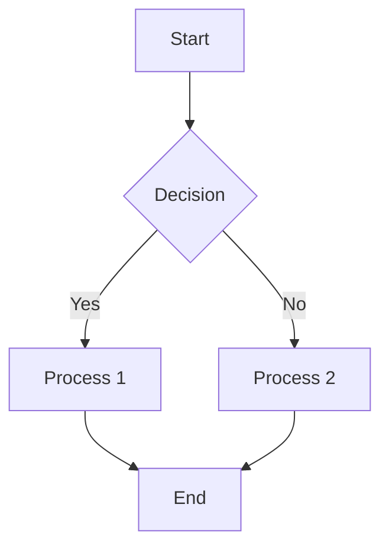
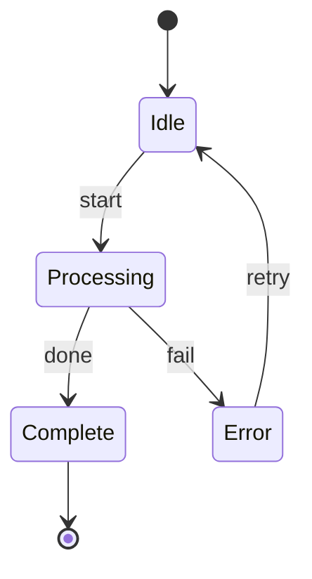
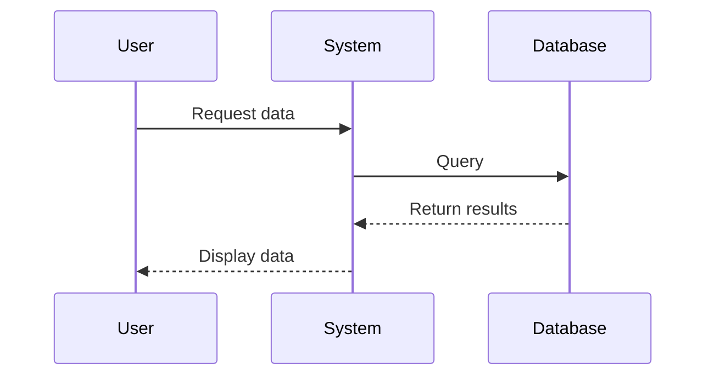
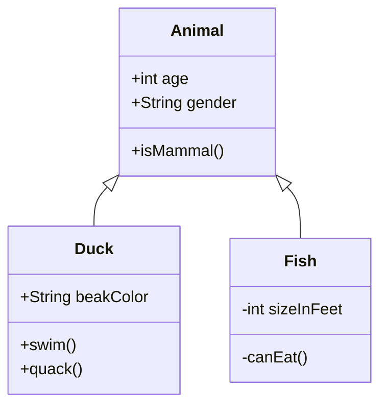
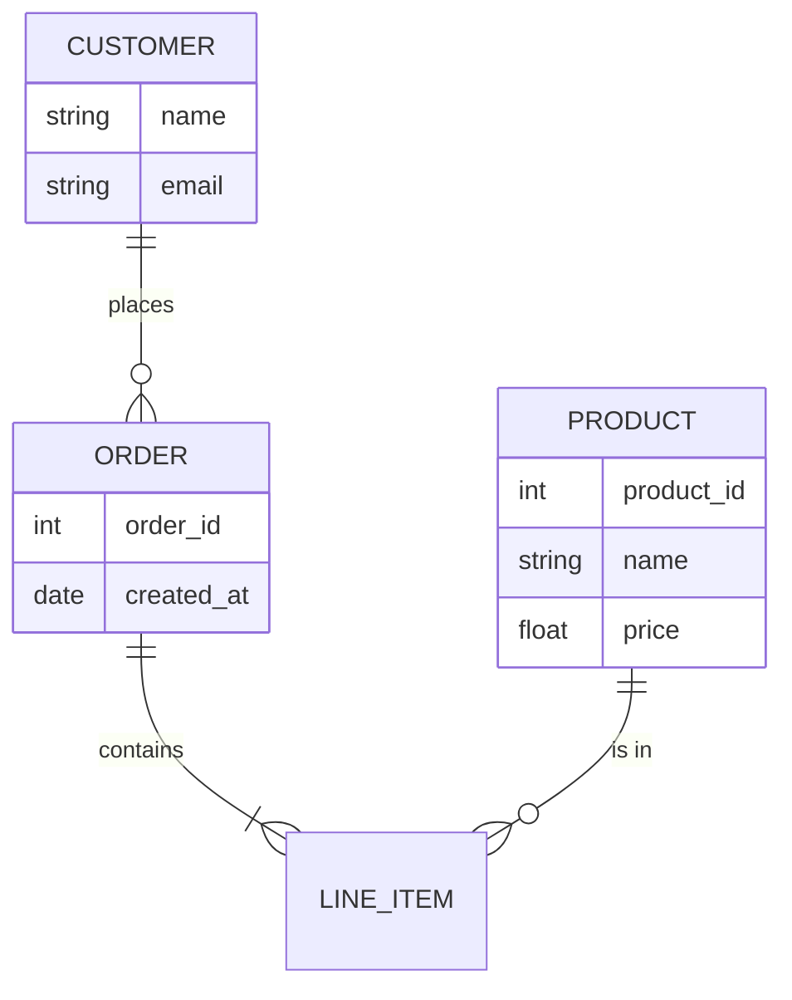

# Beautiful Mermaid 渲染测试

这是一篇隐藏文章，用于测试 beautiful-mermaid 是否正确渲染 Mermaid 图表。

## 流程图 (Flowchart)

## 状态图 (State Diagram)

## 序列图 (Sequence Diagram)

## 类图 (Class Diagram)

## ER 图 (Entity Relationship)

---

如果以上图表都被正确渲染为美观的 SVG，说明 beautiful-mermaid 集成成功！
